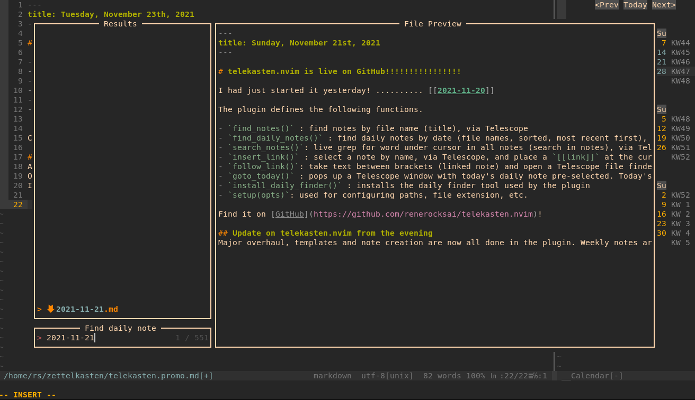
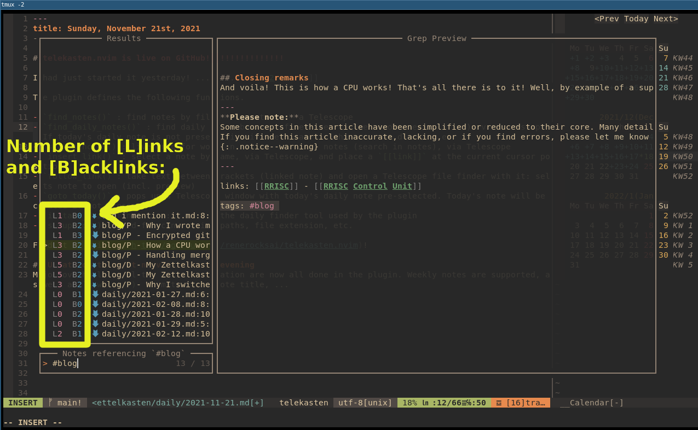
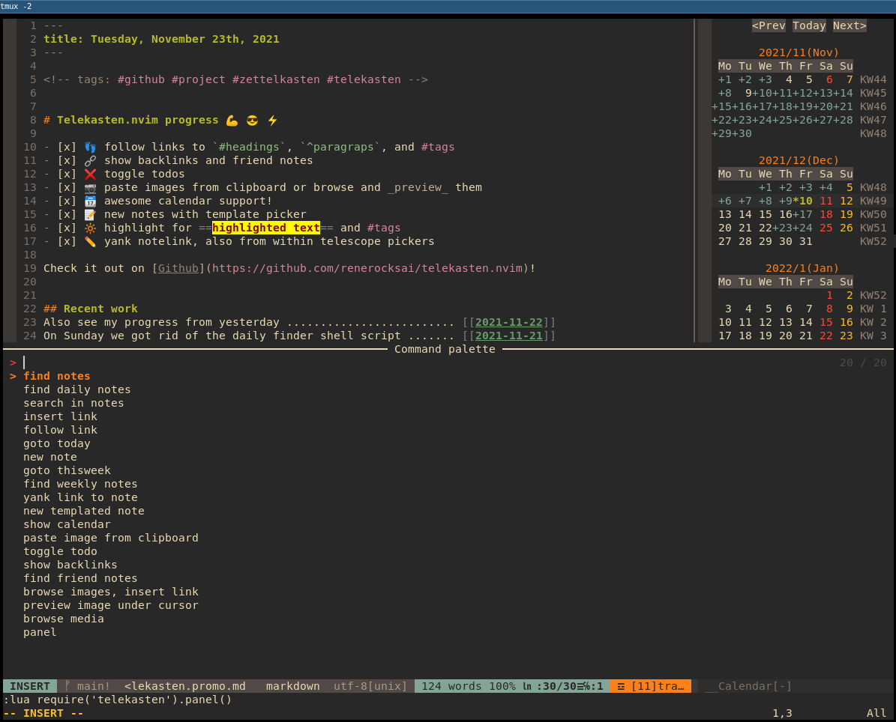

<div align="center">

# .nvim

<!-- [](http://www.lua.org) -->
<!-- [](https://neovim.io) -->
[](http://www.lua.org)
[](https://neovim.io)

</div>

A Neovim (lua) plugin for working with a text-based, markdown [zettelkasten](https://takesmartnotes.com/) / wiki and
mixing it with a journal, based on [telescope.nvim](https://github.com/nvim-telescope/telescope.nvim).

#### Highlights

- Find notes by name, #tag, and daily, weekly notes by date
- search within all notes
- place and follow links to your notes or create new ones, with templates
- current daily and weekly notes are (optionally) created if not present when searching for dailies or weeklies
- following a link to a non-existing note can also create the missing note (optional)
- find notes **that link back to your notes**
- find other notes that link to the same note as the link under the cursor
- support for **links to headings or specific paragraphs** within specific notes or globally (see [link
  notation](#23-link-notation))
- calendar support
- paste images from clipboard
- toggle [ ] todo status of line
- insert links to images
- **image previews**, via `catimg`, `viu`, or extension

<div align="center">

#### New features are being announced in the [discussions](https://github.com/renerocksai/telekasten.nvim/discussions)

</div>

---

== We're Using GitHub Under Protest ==

This project is currently hosted on GitHub.  This is not ideal; GitHub is a
proprietary, trade-secret system that is not Free and Open Souce Software
(FOSS).  We are deeply concerned about using a proprietary system like GitHub
to develop our FOSS project.  We have a
[mailing list](https://lists.sr.ht/~renerocksai/telekasten.nvim-discuss) where the
project contributors are actively discussing how we can move away from GitHub
in the long term.  We urge you to read about the
[Give up GitHub](https://GiveUpGitHub.org) campaign from
[the Software Freedom Conservancy](https://sfconservancy.org) to understand
some of the reasons why GitHub is not a good place to host FOSS projects.

If you are a contributor who personally has already quit using GitHub, please
[check this resource](https://man.sr.ht/git.sr.ht/#sending-patches-upstream) for how to send us contributions without
using GitHub directly: send us patches to the [telekasten.nvim-devel mailing list](https://lists.sr.ht/~renerocksai/telekasten.nvim-devel) or clone the [sourcehut repository](https://git.sr.ht/~renerocksai/telekasten.nvim) and use the web-based "prepare patchset" tool.

Any use of this project's code by GitHub Copilot, past or present, is done
without our permission.  We do not consent to GitHub's use of this project's
code in Copilot.


---

Telekasten.nvim can optionally plug into [calendar-vim](https://github.com/renerocksai/calendar-vim): Selecting a day in
the calendar will open up a telescope search with preview that lets you open the daily note (or cancel out and keep
browsing your calendar). The daily note  will be created if it doesn't exist.  Days with daily notes get marked in the
calendar.

If you have `xclip` installed, Telekasten.nvim can even **paste images from the clipboard** into a dedicated
sub-directory and insert a wiki or markdown link at the current cursor position!

After having written the infamous [sublime_zk](https://github.com/renerocksai/sublime_zk) for SublimeText, having moved
on to my standalone [sublimeless_zk](https://github.com/renerocksai/sublimeless_zk), having tried
[Roam Research](https://roamresearch.com) and [Obsidian.md](https://obsidian.md) (which I still use sparingly), I have
eventually arrived back at the editor I feel at home the most: Neovim 😄! I can literally **live** inside of nvim now,
not only for writing code.

This is the result of my first days of hacking neovim with lua (more features have been added since, see
[Use it](#2-use-it) below the screenshots):


---



---


---



## Search-based navigation

Every navigation action, like following a link, is centered around a Telescope search: a Telescope search popup is
opened, and in the case of following a link, the search-text is pre-filled with the target.  So, instead of opening the
linked note, you get a preview in Telescope and can decide if you actually want to go there. Since the search is often
likely to show up more than one result, you can preview related notes immediately.

### The preview is a powerful feature

Leaving the opening of the note to Telescope, you can decide with one keypress whether you want to open the note in a
split or in the current window - or if you've seen enough.

I find that pressing the enter key to confirm the search does not interrupt my flow, and I really enjoy being able to
check the preview.  I often get enough information from it alone so I don't actually have to "visit" every note in terms
of being able to edit it.

## Contents

<!-- vim-markdown-toc GFM -->

- [0. Install and setup](#0-install-and-setup)
  - [0.0 Prerequisites](#00-prerequisites)
    - [0.0.1 Telescope](#001-telescope)
    - [0.0.2 calendar-vim Plugin (optional)](#002-calendar-vim-plugin-optional)
    - [0.0.3 For pasting images: xclip (optional), wl-clipboard (optional)](#003-for-pasting-images-xclip-optional-wl-clipboard-optional)
    - [0.0.4 For image previews: telescope-media-files.nvim (optional)](#004-for-image-previews-telescope-media-filesnvim-optional)
      - [catimg](#catimg)
      - [viu](#viu)
      - [telescope-media-files.nvim](#telescope-media-filesnvim)
  - [0.1 Install the plugin](#01-install-the-plugin)
    - [0.1.0 Other useful plugins](#010-other-useful-plugins)
  - [0.2 Configure telekasten.nvim](#02-configure-telekastennvim)
  - [0.3 Configure your own colors](#03-configure-your-own-colors)
- [1. Get Help](#1-get-help)
- [2. Use it](#2-use-it)
  - [2.0 Telekasten command](#20-telekasten-command)
  - [2.1 Telekasten command palette](#21-telekasten-command-palette)
  - [2.2 Telekasten lua functions](#22-telekasten-lua-functions)
  - [2.3 Link notation](#23-link-notation)
  - [2.4 Tag notation](#24-tag-notation)
  - [2.5 Note templates](#25-note-templates)
    - [2.5.1 Template files](#251-template-files)
  - [2.6 Using the calendar](#26-using-the-calendar)
  - [2.7 Using the telescope pickers](#27-using-the-telescope-pickers)
- [3. Bind it](#3-bind-it)
- [4. The hardcoded stuff](#4-the-hardcoded-stuff)

<!-- vim-markdown-toc -->

## 0. Install and setup

### 0.0 Prerequisites

#### 0.0.1 Telescope

Since this plugin uses [telescope.nvim](https://github.com/nvim-telescope/telescope.nvim), you need to install it first.

[Neovim (v0.6.0)](https://github.com/neovim/neovim/releases/tag/v0.6.0) or the latest neovim nighly commit is required for `telescope.nvim` to work.

---

#### 0.0.2 calendar-vim Plugin (optional)

Telekasten.nvim can optionally plug into **my bugfixed version of**
[calendar-vim](https://github.com/renerocksai/calendar-vim): Selecting a day in the calendar will open up a telescope
search with preview that lets you open the daily note (or cancel out). The daily note  will be created if it doesn't
exist.  Days with daily notes get marked in the calendar.

See below for installing and using it.

---

#### 0.0.3 For pasting images: xclip (optional), wl-clipboard (optional)

Telekasten.nvim supports pasting images from the clipboard. Currently, this is implemented for systems that have
the `xclip` utility installed or on macs.

On Ubuntu/Debian like systems:

```console
sudo apt-get install xclip
```

On [Wayland](https://wayland.freedesktop.org/) systems you can install [wl-clipboard](https://github.com/bugaevc/wl-clipboard)

On Macs, you should not install a separate tool.  Installing xclip will prevent this feature from working properly.

---

#### 0.0.4 For image previews: telescope-media-files.nvim (optional)

There are two supported ways to preview images:

- via [telescope-media-files.nvim](https://github.com/nvim-telescope/telescope-media-files.nvim)
  - **ONLY supported on Linux**
- via [catimg](https://github.com/posva/catimg)
  - supported at least on Linux and macOS
- via [viu](https://github.com/atanunq/viu)
  - supports both iTerm and Kitty graphics protocols.
  - Note: on my Linux machine, Kitty graphics rendering inside neovim /
    telescope does not work at all, so it falls back to block rendering
    mode.

##### catimg

Just install [catimg](https://github.com/posva/catimg), then set
`media_previewer` to `"catimg-previewer"` in the config.

##### viu

Just install [viu](https://github.com/atanunq/viu), then set
`media_previewer` to `"viu-previewer"` in the config.

##### telescope-media-files.nvim

Per default, or by setting `media_previewer` to `"telescope-media-files"` in the
config, images, PDFs, etc. can be previewed in Telescope while searching for an
image to insert a link to, you need to install the Telescope extension
[telescope-media-files.nvim](https://github.com/nvim-telescope/telescope-media-files.nvim).

This extension has its own list of prerequisites, of which I recommend (and use) the following:

- [Überzug](https://github.com/seebye/ueberzug) (required for image support)
- [ffmpegthumbnailer](https://github.com/dirkvdb/ffmpegthumbnailer) (optional, for video preview support)
- [pdftoppm](https://linux.die.net/man/1/pdftoppm) (optional, for pdf preview support)

Here is a demo from the original authors of
[telescope-media-files.nvim](https://github.com/nvim-telescope/telescope-media-files.nvim):


---

### 0.1 Install the plugin

Install with your plugin manager of choice.  Mine is [Vundle](https://github.com/VundleVim/Vundle.vim).

```vim
Plugin 'renerocksai/telekasten.nvim'
```

I higly recommend using the calendar integration. For that you'll need
[calendar-vim](https://github.com/renerocksai/calendar-vim):

```vim
Plugin 'renerocksai/calendar-vim'
```

#### 0.1.0 Other useful plugins

Other plugins I find useful in my day-to-day zettelkasten work:

- [telescope-symbols.nvim](https://github.com/nvim-telescope/telescope-symbols.nvim)
- [markdown-preview.nvim](https://github.com/iamcco/markdown-preview.nvim)
- [vim-markdown-toc](https://github.com/mzlogin/vim-markdown-toc)
- [telescope-media-files](https://github.com/nvim-telescope/telescope-media-files.nvim)

### 0.2 Configure telekasten.nvim

Somewhere in your vim config, put a snippet like this:

**Windows and macOS** users, please note: While this plugin works on Windows and macOS, it was not specifically designed
to support Windows well. Even on macOS, some of the features like image preview will not work out-of-the-box.

To avoid the most common Windows issue:

- Best option: don't use Windows if possible
- Second best option: try WSL2 on Windows and pretend you're on Linux
- if you **must** use Windows, it is preferable to use `C:/Users/myname/zettelkasten` instead of `~/zettelkasten`
- **NEVER** use `C:\Users\myname` style paths
- Using `vim.fn.expand("~/zettelkasten")` should work now but mileage will vary with anything outside of finding and opening files

```lua
lua << END
local home = vim.fn.expand("~/zettelkasten")
-- NOTE for Windows users:
-- - don't use Windows
-- - try WSL2 on Windows and pretend you're on Linux
-- - if you **must** use Windows, use "/Users/myname/zettelkasten" instead of "~/zettelkasten"
-- - NEVER use "C:\Users\myname" style paths
-- - Using `vim.fn.expand("~/zettelkasten")` should work now but mileage will vary with anything outside of finding and opening files
require('telekasten').setup({
    home         = home,

    -- if true, telekasten will be enabled when opening a note within the configured home
    take_over_my_home = true,

    -- auto-set telekasten filetype: if false, the telekasten filetype will not be used
    --                               and thus the telekasten syntax will not be loaded either
    auto_set_filetype = true,

    -- dir names for special notes (absolute path or subdir name)
    dailies      = home .. '/' .. 'daily',
    weeklies     = home .. '/' .. 'weekly',
    templates    = home .. '/' .. 'templates',

    -- image (sub)dir for pasting
    -- dir name (absolute path or subdir name)
    -- or nil if pasted images shouldn't go into a special subdir
    image_subdir = "img",

    -- markdown file extension
    extension    = ".md",

    -- Generate note filenames. One of:
    -- "title" (default) - Use title if supplied, uuid otherwise
    -- "uuid" - Use uuid
    -- "uuid-title" - Prefix title by uuid
    -- "title-uuid" - Suffix title with uuid
    new_note_filename = "title",

    --[[ file UUID type
        - "rand"
        - string input for os.date()
        - or custom lua function that returns a string
    --]]
    uuid_type = "%Y%m%d%H%M",
    -- UUID separator
    uuid_sep = "-",

    -- if not nil, this string replaces spaces in the title when generating filenames
    filename_space_subst = nil,

    -- following a link to a non-existing note will create it
    follow_creates_nonexisting = true,
    dailies_create_nonexisting = true,
    weeklies_create_nonexisting = true,

    -- skip telescope prompt for goto_today and goto_thisweek
    journal_auto_open = false,

    -- template for new notes (new_note, follow_link)
    -- set to `nil` or do not specify if you do not want a template
    template_new_note = home .. '/' .. 'templates/new_note.md',

    -- template for newly created daily notes (goto_today)
    -- set to `nil` or do not specify if you do not want a template
    template_new_daily = home .. '/' .. 'templates/daily.md',

    -- template for newly created weekly notes (goto_thisweek)
    -- set to `nil` or do not specify if you do not want a template
    template_new_weekly= home .. '/' .. 'templates/weekly.md',

    -- image link style
    -- wiki:     ![[image name]]
    -- markdown: 
    image_link_style = "markdown",

    -- default sort option: 'filename', 'modified'
    sort = "filename",

    -- integrate with calendar-vim
    plug_into_calendar = true,
    calendar_opts = {
        -- calendar week display mode: 1 .. 'WK01', 2 .. 'WK 1', 3 .. 'KW01', 4 .. 'KW 1', 5 .. '1'
        weeknm = 4,
        -- use monday as first day of week: 1 .. true, 0 .. false
        calendar_monday = 1,
        -- calendar mark: where to put mark for marked days: 'left', 'right', 'left-fit'
        calendar_mark = 'left-fit',
    },

    -- telescope actions behavior
    close_after_yanking = false,
    insert_after_inserting = true,

    -- tag notation: '#tag', ':tag:', 'yaml-bare'
    tag_notation = "#tag",

    -- command palette theme: dropdown (window) or ivy (bottom panel)
    command_palette_theme = "ivy",

    -- tag list theme:
    -- get_cursor: small tag list at cursor; ivy and dropdown like above
    show_tags_theme = "ivy",

    -- when linking to a note in subdir/, create a [[subdir/title]] link
    -- instead of a [[title only]] link
    subdirs_in_links = true,

    -- template_handling
    -- What to do when creating a new note via `new_note()` or `follow_link()`
    -- to a non-existing note
    -- - prefer_new_note: use `new_note` template
    -- - smart: if day or week is detected in title, use daily / weekly templates (default)
    -- - always_ask: always ask before creating a note
    template_handling = "smart",

    -- path handling:
    --   this applies to:
    --     - new_note()
    --     - new_templated_note()
    --     - follow_link() to non-existing note
    --
    --   it does NOT apply to:
    --     - goto_today()
    --     - goto_thisweek()
    --
    --   Valid options:
    --     - smart: put daily-looking notes in daily, weekly-looking ones in weekly,
    --              all other ones in home, except for notes/with/subdirs/in/title.
    --              (default)
    --
    --     - prefer_home: put all notes in home except for goto_today(), goto_thisweek()
    --                    except for notes with subdirs/in/title.
    --
    --     - same_as_current: put all new notes in the dir of the current note if
    --                        present or else in home
    --                        except for notes/with/subdirs/in/title.
    new_note_location = "smart",

    -- should all links be updated when a file is renamed
    rename_update_links = true,

    vaults = {
        vault2 = {
            -- alternate configuration for vault2 here. Missing values are defaulted to
            -- default values from telekasten.
            -- e.g.
            -- home = "/home/user/vaults/personal",
        },
    },

    -- how to preview media files
    -- "telescope-media-files" if you have telescope-media-files.nvim installed
    -- "catimg-previewer" if you have catimg installed
    media_previewer = "telescope-media-files",

    -- A customizable fallback handler for urls.
    follow_url_fallback = nil,
})
END
```

| setting | description | example |
| --- | --- | --- |
| `home` | path to your zettelkasten folder (folder with markdown files) | ~/zettelkasten |
|        | NOTE for Windows users: | |
|        | - don't use Windows | |
|        | - try WSL2 on Windows and pretend you're on Linux | |
|        | - if you **must** use Windows, use `/Users/myname/zettelkasten` instead of `~/zettelkasten` | |
|        | - **NEVER** use `C:\Users\myname` style paths | |
|        | - Using `vim.fn.expand("~/zettelkasten")` should work now but mileage will vary with anything outside of finding and opening files | |
| **`take_over_my_home`** | if set to `true` (default), telekasten will take over your home. Any notes from the configured `home` directory will receive a `set filetype=telekasten`, no matter if opened by telekasten or another way. | true |
| `dailies` | path where your daily notes go | ~/zettelkasten/daily |
| `weeklies` | path where your weekly notes go | ~/zettelkasten/weekly |
| `templates` | path where your note templates go | ~/zettelkasten/templates |
| `image_subdir` | sub-directory where pasted images should go | img |
| | set to nil if pasted images shouldn't go into a special subdir | img |
| `image_link_style` | style of img links inserted when pasting images from clipboard | markdown |
|  | `markdown` ... `` | |
|  | `wiki` ... `![[image name]]` | |
| `extension` | filename extension of your note files | .md |
| `follow_creates_nonexisting` | following a link to a non-existing note will create it | true |
| `dailies_create_nonexisting` | following a link to a non-existing daily note will create it | true |
| `weekly_create_nonexisting` | following a link to a non-existing weekly note will create it | true |
| `journal_auto_open` | skip telekscope picker and automatically open the note with goto_today and goto_thisweek | false |
| `template_new_note` | markdown template for new notes | ~/zettelkasten/templates/new_note.md |
| | set to `nil` if you want none | |
| `template_new_daily` | markdown template for new daily notes | ~/zettelkasten/templates/daily.md |
| | set to `nil` if you want none | |
| `template_new_weekly` | markdown template for new weekly notes | ~/zettelkasten/templates/weekly.md |
| | set to `nil` if you want none | |
| `plug_into_calendar` | activate calendar support if true (needs calendar-vim plugin) | true |
| `calendar_opts` | options for calendar, see below | see below |
| `close_after_yanking` | close telescope preview after yanking via <kbd>ctrl</kbd><kbd>y</kbd>| false |
| `insert_after_inserting` | enter insert mode after inserting a link from a telescope picker via <kbd>ctrl</kbd><kbd>i</kbd>| true |
| `tag_notation` | the tag style you want to use| `#tag` |
| | - `#tag` (default) | |
| | - `:tag:` | |
| | - `yaml-bare` | |
| `rename_update_links` | update links when a file is renamed | true |
| | see [2.1 Tag notation](#24-tag-notation)| |
| `command_palette_theme` | theme (layout) of the command palette| ivy |
| | - `ivy` (default): bottom panel overlay  |  |
| | - `dropdown`: floating popup window ||
| `show_tags_theme` | theme (layout) for the tag list| ivy |
| | - `ivy` (default): bottom panel overlay  |  |
| | - `dropdown`: floating popup window ||
| | - `get_cursor`: floating popup window at cursor position ||
| `subdirs_in_links` | include subdirs (if applicable) in generated (yanked, inserted) links| true |
| `auto_set_filetype` | if false (not recommended), the telekasten filetype will not be used and the telekasten syntax not be loaded; markdown files will get the markdown filetype. | default: `true` |
| `template_handling` | Strategy for telekasten to pick a template when a new note is created via `new_note()` or by `follow_link()` to a non-existing note | smart |
| | - `smart` (default): if day or week is detected in title, use daily / weekly templates, else the new note template|  |
| | - `prefer_new_note`: use the `new_note` template ||
| | - `always_ask`: always ask which template to use (template picker) ||
| `new_note_location` | Path handling for `new_note()`, `new_templated_note()`, `follow_link()` to non-existing note| smart |
| | - `smart` (default): put daily-looking (date as title) into the daily folder, weekly-looking notes into the weekly folder, all other ones into the home folder, except for notes with `sub/folders` in the title.|  |
| | - `prefer_home`: put all notes in home folder except for `goto_today()` and `goto_thisweek()`, and notes with `sub/folders` in the title ||
| | - `same_as_current`: put all new notes in the directory of the currently open note (where the cursor is) if present or else into the home folder, except for notes with `sub/folders/` in the title||
| `vaults` | a table of additional vault configurations. Default config values are assumed for all config settings that are not specified for additional vaults | `vaults = { second_vault = { home = "/home/rs/vaults/second", }, third_vault: { home = "/home/rs/vaults/third", }, }` |
| `media_previewer` | how to preview media files | default: `telescope-media-files` |
|| - `telescope-media-files` if you have telescope-media-files.nvim installed |
|| - `catimg-previewer` if you have catimg installed |
| `follow_url_fallback` | A customizable fallback handler for urls. | default: `nil` |

The calendar support has its own options, contained in `calendar_opts`:

| calendar setting | description | example |
| --- | --- | --- |
| `weeknm` | calendar week display mode | 1 |
|          | 1 .. 'WK01' | |
|          | 2 .. 'WK 1' | |
|          | 3 .. 'KW01' | |
|          | 4 .. 'KW 1' | |
|          | 5 .. '1' | |
| `calendar_monday` | use monday as start of week if 1 | 1 |
| `calendar_mark` | where to put marks to mark days with daily notes | 'left-fit' |
|                 | 'left' : ugly | |
|                 | 'left-fit' : mark to the left of the day| |
|                 | 'right' : mark to the right of the day| |

### 0.3 Configure your own colors

Telekasten.nvim allows you to color your `[[links]]` and `#tags` by providing the following syntax groups:

- `tkLink` : the link title inside the brackets
- `tkBrackets` : the brackets surrounding the link title
- `tkHighlight` : ==highlighted== text (non-standard markdown)
- `tkTag` :  well, tags

`tkHighlight` has nothing to do with links but I added it anyway, since I like highlighting text when
taking notes 😄.

I also like the navigation buttons of the calendar to appear less prevalent, so I also redefine the `CalNavi` class.

You can assign colors to the new syntax groups in your `init.vim`:

```vim
" just blue and gray links
hi tkLink ctermfg=Blue cterm=bold,underline guifg=blue gui=bold,underline
hi tkBrackets ctermfg=gray guifg=gray


" for gruvbox
hi tklink ctermfg=72 guifg=#689d6a cterm=bold,underline gui=bold,underline
hi tkBrackets ctermfg=gray guifg=gray

" real yellow
hi tkHighlight ctermbg=yellow ctermfg=darkred cterm=bold guibg=yellow guifg=darkred gui=bold
" gruvbox
"hi tkHighlight ctermbg=214 ctermfg=124 cterm=bold guibg=#fabd2f guifg=#9d0006 gui=bold

hi link CalNavi CalRuler
hi tkTagSep ctermfg=gray guifg=gray
hi tkTag ctermfg=175 guifg=#d3869B
```

## 1. Get Help

Telekasten.nvim now comes with its own help file. So you can always:

```vim
:h telekasten.nvim
```

or

```vim
:h telekasten.<TAB>   " or whatever your completion key is there
```

or .. **just use telescope**: `:Telescope help_tags` and search for `telekasten`.

## 2. Use it

You can use the plugin either by executing the `:Telekasten <sub-command>` command or by calling one of its lua
functions that implement the _sub-commands_.

Which method you use is up to you. Note that you cannot pass arguments to the Telekasten command, but you can add
arguments to some of the lua functions.

### 2.0 Telekasten command

```vim
:Telekasten <sub-command>
```

The following sub-commands are defined; check their corresponding [lua functions](#22-telekasten-lua-functions) below
the list for a more detailed description:

- `panel` : brings up the [command palette](#21-telekasten-command-palette)
- `find_notes` : Find notes by title (filename)
- `show_tags` : brings up the tag list. From there you can select a tag to search for tagged notes - or yank or insert the tag
- `find_daily_notes` : Find daily notes by title (date)
- `search_notes` : Search (grep) in all notes
- `insert_link` : Insert a link to a note
- `follow_link` : Follow the link under the cursor
- `goto_today` : Open today's daily note
- `new_note` : Create a new note, prompts for title
- `goto_thisweek` : Open this week's weekly note
- `find_weekly_notes` : Find weekly notes by title (calendar week)
- `yank_notelink` : Yank a link to the currently open note
- `new_templated_note` : create a new note by template, prompts for title and template
- `show_calendar` : Show the calendar
- `paste_img_and_link` : Paste an image from the clipboard into a file and inserts a link to it
- `toggle_todo` : Toggle `- [ ]` todo status of a line
- `show_backlinks` : Show all notes linking to the current one
- `find_friends` : Show all notes linking to the link under the cursor
- `insert_img_link` : Browse images / media files and insert a link to the selected one
- `preview_img` : preview image under the cursor
- `browse_media` : Browse images / media files
- `rename_note` : Rename current note and update the links pointing to it
- `switch_vault` : switch the vault. Brings up a picker. See the `vaults` config
  option for more.

The Telekasten command supports sub-command completion, in my case by pressing <kbd>TAB</kbd>.

### 2.1 Telekasten command palette

With `:Telekasten panel` or `:lua require('telekasten').panel()` you can bring up the command palette, which is a
telescope search through all Telekasten commands.

This is super useful for your keyboard mappings: suppose all your telekasten mappings start with `<leader>z`. Like
in the following example:

```vim
nnoremap <leader>zf :lua require('telekasten').find_notes()<CR>
nnoremap <leader>zd :lua require('telekasten').find_daily_notes()<CR>
nnoremap <leader>zg :lua require('telekasten').search_notes()<CR>
nnoremap <leader>zz :lua require('telekasten').follow_link()<CR>
```

Then, simply bind `panel()` to `<leader>z`:

```vim
nnoremap <leader>zf :lua require('telekasten').find_notes()<CR>
nnoremap <leader>zd :lua require('telekasten').find_daily_notes()<CR>
nnoremap <leader>zg :lua require('telekasten').search_notes()<CR>
nnoremap <leader>zz :lua require('telekasten').follow_link()<CR>

" on hesitation, bring up the panel
nnoremap <leader>z :lua require('telekasten').panel()<CR>
```

The moment you hesitate after pressing `<leader>z` instead of pressing the disambiguating second letter, Telekasten will
make it easy for you and pop up a panel:



The above illustration shows the default configuration of the panel layout: `ivy`. You can change it to a popup window
by setting `command_palette_theme = 'dropdown'` during `setup()`.

This is what the popup looks like:


### 2.2 Telekasten lua functions

The plugin defines the following functions:

- `new_note()` : prompts for title and creates new note by template, then shows it in Telescope
- `new_templated_note()` : prompts for title and then uses telescope for choosing a template. When a template is
  selected, a new note is created with it and opened. Should the note exist, it is opened immediately
- `find_notes()` : find notes by file name (title), via Telescope
- `find_daily_notes()` : find daily notes by date (file names, sorted, most recent first), via Telescope.  If today's
  daily note is not present, it can be created optionally, honoring the configured template
- `goto_today()` : pops up a Telescope window with today's daily note pre-selected. Today's note can optionally be
  created if not present, using the configured template
- `find_weekly_notes()` : find weekly notes by week (file names, sorted, most recent first), via Telescope.  If this
  week's weekly note is not present, it can be created optionally, honoring the configured template
- `goto_thisweek()` : pops up a Telescope window with this week's weekly note pre-selected. This week's note can
  optionally be created if not present, using the configured template
- `search_notes()`: live grep for word under cursor in all notes (search in notes), via Telescope
- `insert_link()` : select a note by name, via Telescope, and place a `[[link]]` at the current cursor position
  - **note**:
    - this function accepts a parameter `{i}`. If `true`, it will enter input mode by pressing the 'A' key. This is
      useful when being used in a simple `inoremap` key mapping like shown in [Bind it](#3-bind-it).
      - example: `insert_link({ i=true })`
    - this function accepts a parameter `{with_live_grep}`. If `true`, it will use live_grep picker and you can search file by file contents.
- `follow_link()`: take text between brackets (linked note) or of a tag and open a Telescope file finder with it: selects note to
  open (incl. preview) - with optional note creation for non-existing notes, honoring the configured template
  - **note**:
    - notes linked to with headings or paragraph IDs **will not be created automatically**. See below for link notation.
- `yank_notelink()` : yank a link to the current note, ready to paste
- `show_calendar()` : opens up the calendar in a properly-sized vertical split at the very right
- `paste_img_and_link()` : pastes an image from the clipboard into a file under `image_subdir` and inserts a link to it
  at the current cursor position
- `toggle_todo()` : turn a line into a `- [ ]` line, or toggle between `- [ ]`, `- [x]`, and `-`.
  - **note**:
    - this function accepts a parameter `{i}`. If `true`, it will enter input mode by pressing the 'A' key. This is
      useful when being used in a simple `inoremap` key mapping like shown in [Bind it](#3-bind-it).
    - example: `toggle_todo({ i=true })`
    - this function also accepts `{v}` for visual mode. If `true`, then it will look for a visual range of text to
      toggle. When setting this to a keymapping, use `:` instead of `<cr>` to create the command as seen below:
    - example keymapping: `:lua require('telekasten').toggle_todo({ v = true })<cr>`
    - this function has also a `{onlyTodo}` parameter. If `true`, this will
      avoid circling back to a regular list (`-`).
    - this function can also be used in `visual` mode  to toggle the status of multiple lines.
- `show_backlinks()` : opens a telescope search for notes that `[[link]]` back to the current note.
- `find_friends()` : opens a telescope search for notes that also `[[link]]` to the link under the cursor.
- `insert_img_link()` : opens a telescope search for all media (PDFs, images, videos (MP4, webm)) and places a markdown
  image link to the picked one at the cursor position.
  - **note**:
    - if the `telescope-media-files.nvim` plugin is installed, **a preview of images / media files will be given**
      during the search.
    - this function accepts a parameter `{i}`. If `true`, it will enter input mode by pressing the 'A' key. This is
      useful for being able to continue to type after link insertion. See also: [Bind it](#3-bind-it).
    - example: `insert_link({ i=true })`
- `preview_img()` : uses the `telescope-media-files.nvim` extension to preview the image / media file under the cursor
  of a markdown image link: ``. The cursor must be between `(the two parenthesis)`.
  - **note**: this requires the `telescope-media-files.nvim` plugin to be installed.
- `browse_media()` : uses the `telescope-media-files.nvim` extension to preview the image / media file linked to under the cursor.
  - **note**: this requires the `telescope-media-files.nvim` plugin to be installed.
- `setup(opts)`: used for configuring paths, file extension, etc.
- `panel()` : brings up the command palette
- `show_tags()` : brings up the tag list. From there you can select a tag to search for tagged notes - or yank or insert the tag
- `rename_note()` : rename the current note and update the links pointing to it
- `switch_vault()` : switch the vault

To use one of the functions above, just run them with the `:lua ...` command.

```vim
:lua require("telekasten").find_daily_notes()
```

### 2.3 Link notation

The following links are supported:

```markdown
# Note links
- [[A cool title]]  ................. links to the note named 'A cool title'
- [[A cool title#Heading 27]]  ...... links to the heading 'Heading 27' within the note
                                      named 'A cool title'
- [[A cool title#^xxxxxxxx]]  ....... links to the paragraph with id ^xxxxxxxx within the note
                                      named 'A cool title'
- [[201705061300|A cool title]] ..... links to the note named `201705061300` but shows the link as
                                      `A cool title` if `conceallevel=2`
- [[#Heading 27]]  .................. links to the heading 'Heading 27' within all notes
- [[#^xxxxxxxx]]  ................... links to the paragraph with id ^xxxxxxxx within all notes

## Optionally, notes can live in specific sub-directories
- [[some/subdirectory/A cool title]]  ................. links to note named 'A cool title'
                                                        in some/subdirectory
- [[some/subdirectory/A cool title#Heading 27]]  ...... links to the heading 'Heading 27' within
                                                        the note named 'A cool title'
                                                        in some/subdirectory
- [[some/subdirectory/A cool title#^xxxxxxxx]]  ....... links to the paragraph with
                                                        id ^xxxxxxxx within the note named
                                                        'A cool title' in some/subdirectory

# Media links
Use these for images, PDF files, videos. If telescope-media-files is installed, these can
be previewed.
-  ... links to the file `path/to/file`
```

You can `follow_link()` all of the above, with the exception of media links, which you can `preview_img()`.

Note that notes linked to with headings or paragraph IDs **will not be created automatically**. Non-existing notes will
be ignored, a global search will be performed instead.

For now, you have to create such links yourself.  You can edit existing links and append headings, for example: From
`[[The note]]` to `[[The note#Some heading or subheading]]`.

Regarding linking to paragraphs: The `^blockid` notation is supported by more and more tools now. It works like this:

- at the end of a line / paragraph you want to link to, you put some block id marker in the form of `^block-id`.
- typically, block ids are tool-generated - but no one can stop you defining your own.
  - tool-generated block ids look like this: `^xAcSh-xxr`.
- instead of linking to a heading, you use the block id as heading: `[[Some note#^block-id]]`.
- instead of putting the block id at the end of a line, you can also make a line break and put it in the next line, like
  illustrated below.

  ```markdown
  Here we have a line or even a paragraph.
  We don't want to have a block id dangling
  at the end of a line. So instead, we just
  put it in the next one.
  ^xxxblkxx

  Here goes the next paragraph.
  ```

### 2.4 Tag notation

Telekasten supports the following tag notations:

1. `#tag`
2. `:tag:`
3. `yaml-bare`: bare tags in a tag collection in the yaml metadata:

```yaml
---
title: My awesome note
date: 2021-12-06
tags: [ example, note-taking, foo, bar ]
---
```

**Tag syntax**: Spaces are not allowed in tags. So, to differentiate two or more words in a tag, use one of the
following formats:

- camelCase: `#noteTaking`
- PascalCase: `#NoteTaking`
- snake_case: `#note_taking`
- kebab-case: `#note-taking`

The only symbols allowed are:

- `_` : underscore
- `-` : dash
- `/` : forward slash

Numbers are allowed in tags, as long as a tag is not purely numeric. For example, #1984 is not a valid tag, but `#y1984`
is.

**Note**: When using the `#tag` notation, telekasten will try to differentiate
an actual tag from an hexadecimal code (e.g. `#FF0000`) to prevent false
matches. This is achieved by using the `--pcre2` flag of `ripgrep`. However,
some linux distribution (mostly the ones based on Debian) do not compile ripgrep
with this flag by default, making it impossible to use. If this is the case, the
tag functions of telekasten will not be able to differentiate color codes from
actual tags and will return everything. A workaround is to either use the
`:tag:` notation or to recompile ripgrep locally with the appropriate flag (see
issues # 115 and #145).

**Note**: For proper highlighting, the `auto_set_filetype` option is set to `true` by default. This automatically
switches the filetype of opened notes from `markdown` to `telekasten`, and also registers the syntax with telescope
previewers for `.md` files.

### 2.5 Note templates

The functions `goto_today`, `goto_thisweek`, `find_daily_notes`, `find_weekly_notes`, and `follow_link` can create
non-existing notes. This allows you to 'go to today' without having to create today's note beforehand. When you just
type `[[some link]]` and then call `follow_link`, the 'some link' note can be generated.

The following table shows what action creates what kind of non-existing note:

| ACTION | config option | creates what |
| --- | --- | --- |
| `goto_today()` | `dailies_create_nonexisting` | today's daily note |
| [ENTER] on a day in the calendar | `dailies_create_nonexisting` | selected day's daily note |
| `find_daily_notes()` | `dailies_create_nonexisting` | today's daily note |
| `goto_thisweek()` | `weeklies_create_nonexisting` | this week's weekly note |
| `find_weekly_notes()` | `weeklies_create_nonexisting` | this week's weekly note |
| `follow_link()` | `follow_creates_nonexisting` | new note |
| `new_note()` | always true | new note |
| `new_templated_note()` | always true | new note |

If the associated option is `true`, non-existing notes will be created.

#### 2.5.1 Template files

The options `template_new_note`, `template_new_daily`, and `template_new_weekly` are used to specify the paths to
template text files that are used for creating new notes.

Currently, the following substitutions will be made during new note creation:

| specifier in template | expands to | example |
| --- | --- | --- |
| `{{title}}` | the title of the note | My new note |
| `{{shorttitle}}` | the short title of the note | dir/subdir/My Note -> My Note |
| `{{uuid}}` | UUID for the note | 202201271129 |
| `{{date}}` | date in iso format | 2021-11-21 |
| `{{time24}}` | time with 24 hour clock | 19:12:23 |
| `{{time12}}` | time with 12 hour clock | 07:12:23 PM |
| `{{prevday}}` | previous day's date in iso format | 2021-11-20 |
| `{{nextday}}` | next day's date in iso format | 2021-11-22 |
| `{{hdate}}` | date in long format | Sunday, November 21st, 2021 |
| `{{rfc3339}}`     | date in RFC3339 format| 2021-11-21T14:30Z+01:00   |
| `{{week}}` | week of the year | 46 |
| `{{prevweek}}` | previous week of the year | 45 |
| `{{nextweek}}` | next week of the year | 47 |
| `{{isoweek}}` | week of the year in iso format | 2021-W46 |
| `{{isoprevweek}}` | previous week of the year in iso format | 2021-W45 |
| `{{isonextweek}}` | next week of the year in iso format| 2021-W47 |
| `{{year}}` | year | 2021 |
| `{{monday}}` | monday's date | 2021-11-16 |
| `{{tuesday}}` | tuesday's date | 2021-11-17 |
| `{{wednesday}}` | wednesday's date | 2021-11-18 |
| `{{thursday}}` | thursday's date | 2021-11-19 |
| `{{friday}}` | friday's date | 2021-11-20 |
| `{{saturday}}` | saturday's date | 2021-11-21 |
| `{{sunday}}` | sunday's date | 2021-11-22 |
Note: Sunday will be adjusted by the user's `calendar_monday` preference.

As an example, this is my template for new notes:

```markdown
---
title: {{title}}
date:  {{date}}
---
```

And I use this one for daily notes:

```markdown
---
title: {{hdate}}
---
```

And finally, the weekly notes (that I don't use a lot):

```markdown
---
title: {{year}}-W{{week}}
date:  {{hdate}}
---

# Review Week {{week}} / {{year}}

---

## Highlights
- **this**!
- that!

## Monday     .........  [[{{monday}}]]
## Tuesday    .........  [[{{tuesday}}]]
## Wednesday  .........  [[{{wednesday}}]]
## Thursday   .........  [[{{thursday}}]]
## Friday     .........  [[{{friday}}]]
## Saturday   .........  [[{{saturday}}]]
## Sunday     .........  [[{{sunday}}]]
```

### 2.6 Using the calendar

When invoking `show_calendar()`, a calendar showing the previous, current, and next month is shown at the right side of
vim.

- days that have a daily note associated with them are marked with a + sign and a different color
- pressing enter on a day will open up a telescope finder with the associated daily note selected and previewed. The
  daily note will be created if it doesn't exist. If you choose to not open the note, you will return to the calender so
  you can preview other notes.

If you want to see a big calendar showing the current month that fills your entire window, you can issue the following
command in vim:

```vim
:CalendarT
```

### 2.7 Using the telescope pickers

When you are prompted with a telescope picker to select a note or media file, the following mappings apply:

- <kbd>CTRL</kbd> + <kbd>i</kbd> : inserts a link to the selected note / image
  - the option `insert_after_inserting` defines if insert mode will be entered after the link is pasted into your
    current buffer
- <kbd>CTRL</kbd> + <kbd>y</kbd> : yanks a link to the selected note / image, ready for <kbd>p</kbd>asting
  - the option `close_after_yanking` defines whether the telescope window should be closed when the link has been
    yanked
- <kbd>RETURN / ENTER</kbd> : usually opens the selected note or performs the action defined by the called function
  - e.g. `insert_img_link()`'s action is to insert a link to the selected image.

## 3. Bind it

Usually, you would set up some key bindings, though:

```vim
nnoremap <leader>zf :lua require('telekasten').find_notes()<CR>
nnoremap <leader>zd :lua require('telekasten').find_daily_notes()<CR>
nnoremap <leader>zg :lua require('telekasten').search_notes()<CR>
nnoremap <leader>zz :lua require('telekasten').follow_link()<CR>
nnoremap <leader>zT :lua require('telekasten').goto_today()<CR>
nnoremap <leader>zW :lua require('telekasten').goto_thisweek()<CR>
nnoremap <leader>zw :lua require('telekasten').find_weekly_notes()<CR>
nnoremap <leader>zn :lua require('telekasten').new_note()<CR>
nnoremap <leader>zN :lua require('telekasten').new_templated_note()<CR>
nnoremap <leader>zy :lua require('telekasten').yank_notelink()<CR>
nnoremap <leader>zc :lua require('telekasten').show_calendar()<CR>
nnoremap <leader>zC :CalendarT<CR>
nnoremap <leader>zi :lua require('telekasten').paste_img_and_link()<CR>
nnoremap <leader>zt :lua require('telekasten').toggle_todo()<CR>
nnoremap <leader>zb :lua require('telekasten').show_backlinks()<CR>
nnoremap <leader>zF :lua require('telekasten').find_friends()<CR>
nnoremap <leader>zI :lua require('telekasten').insert_img_link({ i=true })<CR>
nnoremap <leader>zp :lua require('telekasten').preview_img()<CR>
nnoremap <leader>zm :lua require('telekasten').browse_media()<CR>
nnoremap <leader>za :lua require('telekasten').show_tags()<CR>
nnoremap <leader># :lua require('telekasten').show_tags()<CR>
nnoremap <leader>zr :lua require('telekasten').rename_note()<CR>

" on hesitation, bring up the panel
nnoremap <leader>z :lua require('telekasten').panel()<CR>

" we could define [[ in **insert mode** to call insert link
" inoremap [[ <cmd>:lua require('telekasten').insert_link()<CR>
" alternatively: leader [
inoremap <leader>[ <cmd>:lua require('telekasten').insert_link({ i=true })<CR>
inoremap <leader>zt <cmd>:lua require('telekasten').toggle_todo({ i=true })<CR>
inoremap <leader># <cmd>lua require('telekasten').show_tags({i = true})<cr>

" ----- the following are for syntax-coloring [[links]] and ==highlighted text==
" ----- (see the section about coloring in README.md)

" for gruvbox
hi tklink ctermfg=72 guifg=#689d6a cterm=bold,underline gui=bold,underline
hi tkBrackets ctermfg=gray guifg=gray

" real yellow
hi tkHighlight ctermbg=yellow ctermfg=darkred cterm=bold guibg=yellow guifg=darkred gui=bold
" gruvbox
"hi tkHighlight ctermbg=214 ctermfg=124 cterm=bold guibg=#fabd2f guifg=#9d0006 gui=bold

hi link CalNavi CalRuler
hi tkTagSep ctermfg=gray guifg=gray
hi tkTag ctermfg=175 guifg=#d3869B
```

## 4. The hardcoded stuff

Currently, the following things are hardcoded:

- the file naming format for daily note files: `YYYY-MM-DD.ext` (e.g. `2021-11-21.md`)
- the file naming format for weekly note files: `YYYY-Www.ext` (e.g. `2021-W46.md`)
- the file naming format for pasted images: `pasted_img_YYYYMMDDhhmmss.png` (e.g. `pasted_img_20211126041108.png`)

---
_The Telekasten logo is based on the neovim logo attributed to Jason Long, neovim,
[CC-BY-3.0](https://commons.wikimedia.org/wiki/Category:CC-BY-3.0)._
