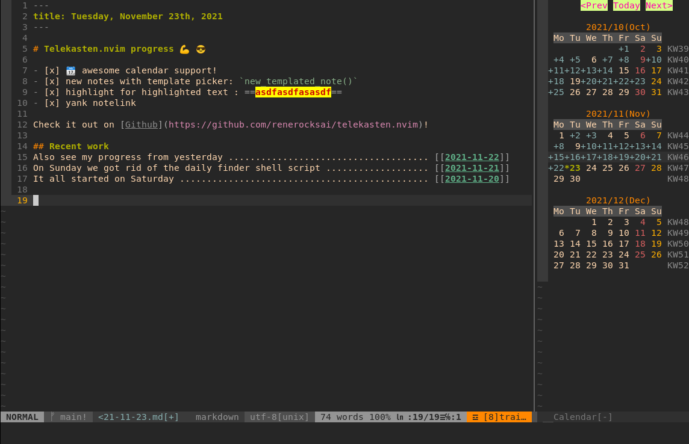
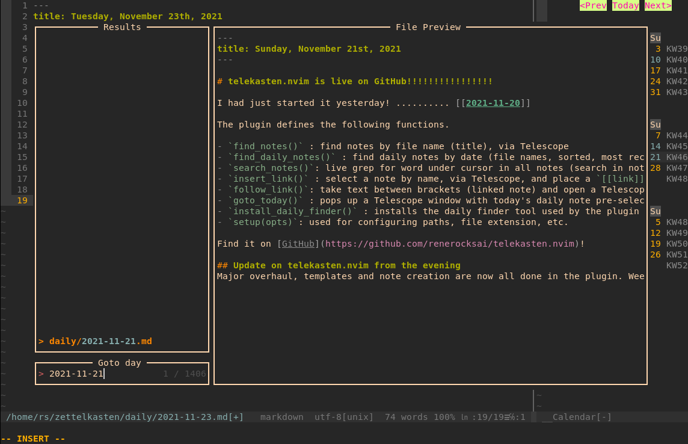

# telekasten.nvim

A Neovim (lua) plugin for working with a text-based, markdown [zettelkasten](https://takesmartnotes.com/) / Wiki and mixing it with a journal, based on [telescope.nvim](https://github.com/nvim-telescope/telescope.nvim).

Find notes by name, daily and weekly notes by date, search within all notes, place and follow links to your notes or create new ones, with templates.  Current daily and weekly notes are (optionally) created if not present when searching for dailies or weeklies.  Following a link to a non-existing note can also create the missing note (optional). 

Telekasten.nvim can optionally plug into [calendar-vim](https://github.com/mattn/calendar-vim): Selecting a day in the calendar will open up a telescope search with preview that lets you open the daily note (or cancel out and keep browsing your calendar). The daily note  will be created if it doesn't exist.  Days with daily notes get marked in the calendar. 

After having written the infamous [sublime_zk](https://github.com/renerocksai/sublime_zk) for SublimeText, having moved on to my standalone [sublimeless_zk](https://github.com/renerocksai/sublimeless_zk), having tried [Roam Research](https://roamresearch.com) and [Obsidian.md](https://obsidian.md) (which I still use sparingly), I have eventually arrived back at the editor I feel at home the most: Neovim 😄! I can literally **live** inside of nvim now, not only for writing code.

This is the result of my first days of hacking neovim with lua:



---



## Search-based navigation

Every navigation action, like following a link, is centered around a Telescope search: a Telescope search popup is opened, and in the case of following a link, the search-text is pre-filled with the target.  So, instead of opening the linked note, you get a preview in Telescope and can decide if you actually want to go there. Since the search is often likely to show up more than one result, you can preview related notes immediately. 

### The preview is a powerful feature
Leaving the opening of the note to Telescope, you can decide with one keypress whether you want to open the note in a split or in the current window - or if you've seen enough.

I find that pressing the enter key to confirm the search does not interrupt my flow, and I really enjoy being able to check the preview.  I often get enough information from it alone so I don't actually have to "visit" every note in terms of being able to edit it.

## Install and setup


### 0. Prerequisites 

#### Telescope
Since this plugin uses [telescope.nvim](https://github.com/nvim-telescope/telescope.nvim), you need to install it first.

[Neovim (v0.5.1)](https://github.com/neovim/neovim/releases/tag/v0.5.1) or the latest neovim nighly commit is required for `telescope.nvim` to work.

#### Ripgrep
For proper sort order of daily notes, the `rg` executable ([Ripgrep](https://github.com/BurntSushi/ripgrep)) is required and needs to be installed so that nvim can find it. So make sure it's in your path. 

If rg isn't found at `setup()` time, it will not be used. In that case, the sort order of daily and weekly notes are likely to be reversed or total garbage. I do accept pull requests, though, for a lua implementation 😁!

If you can't use `rg`, I recommend using `goto_today()` and `goto_thisweek()` instead of `find_daily_notes()` and `find_weekly_notes()`, as this pre-fills the search field, which makes the results list look a bit more sane.

#### calendar-vim Plugin (optional)

Telekasten.nvim can optionally plug into [calendar-vim](https://github.com/mattn/calendar-vim): Selecting a day in the calendar will open up a telescope search with preview that lets you open the daily note (or cancel out). The daily note  will be created if it doesn't exist.  Days with daily notes get marked in the calendar. 

See below for installing and using it.


### 1. Install the plugin
Install with your plugin manager of choice.  Mine is [Vundle](https://github.com/VundleVim/Vundle.vim).

```vim
Plugin 'renerocksai/telekasten.nvim'
```

I higly recommend using the calendar integration. For that you'll need [calendar-vim](https://github.com/mattn/calendar-vim):

```vim
Plugin 'mattn/calendar-vim'
```


### 2. Configure telekasten.nvim
Somewhere in your vim config, put a snippet like this:

```lua
lua << END
local home = vim.fn.expand("~/zettelkasten")
require('telekasten').setup({
    home         = home
    dailies      = home .. '/' .. 'daily',
    weeklies     = home .. '/' .. 'weekly',
    templates    = home .. '/' .. 'templates',
    extension    = ".md",

    -- following a link to a non-existing note will create it
    follow_creates_nonexisting = true,
    dailies_create_nonexisting = true,
    weeklies_create_nonexisting = true,

    -- template for new notes (new_note, follow_link)
    template_new_note = home .. '/' .. 'templates/new_note.md',

    -- template for newly created daily notes (goto_today)
    template_new_daily = home .. '/' .. 'templates/daily.md',

    -- template for newly created weekly notes (goto_thisweek)
    template_new_weekly= home .. '/' .. 'templates/weekly.md',

    -- integrate with calendar-vim
    plug_into_calendar = true,
    calendar_opts = {
        -- calendar week display mode: 1 .. 'WK01', 2 .. 'WK 1', 3 .. 'KW01', 4 .. 'KW 1', 5 .. '1'
        weeknm = 4,
        -- use monday as first day of week: 1 .. true, 0 .. false
        calendar_monday = 1,
        -- calendar mark: where to put mark for marked days: 'left', 'right', 'left-fit'
        calendar_mark = 'left-fit',
    }
})
END
```
| setting | description | example |
| --- | --- | --- | 
| `home` | path to your zettelkasten folder (folder with markdown files) | ~/zettelkasten |
| `dailies` | path where your daily notes go | ~/zettelkasten/daily |
| `weeklies` | path where your weekly notes go | ~/zettelkasten/weekly |
| `templates` | path where your note templates go | ~/zettelkasten/templates |
| `extension` | filename extension of your note files | .md |
| `follow_creates_nonexisting` | following a link to a non-existing note will create it | true |
| `dailies_create_nonexisting` | following a link to a non-existing daily note will create it | true |
| `weekly_create_nonexisting` | following a link to a non-existing weekly note will create it | true |
| `template_new_note` | markdown template for new notes | ~/zettelkasten/templates/new_note.md | 
| `template_new_daily` | markdown template for new daily notes | ~/zettelkasten/templates/daily.md | 
| `template_new_weekly` | markdown template for new weekly notes | ~/zettelkasten/templates/weekly.md | 
| `plug_into_calendar` | activate calendar support if true (needs calendar-vim plugin) | true | 
| `calendar_opts` | options for calendar, see below | see below | 

The calendar support has its own options, contained in `calendar_opts`:

| calendar setting | description | example |
| --- | --- | --- | 
| `weeknm` | calendar week display mode | 1 | 
|          | 1 .. 'WK01' | | 
|          | 2 .. 'WK 1' | | 
|          | 3 .. 'KW01' | | 
|          | 4 .. 'KW 1' | | 
|          | 5 .. '1' | | 
| `calendar_monday` | use monday as start of week if 1 | 1 | 
| `calendar_mark` | where to put marks to mark days with daily notes | 'left-fit' | 
|                 | 'left' : ugly | | 
|                 | 'left-fit' : mark to the left of the day| | 
|                 | 'right' : mark to the right of the day| | 


### 3. Configure your own colors
Telekasten.nvim allows you to color your `[[links]]` by providing two syntax groups:

- `tkLink` : the link title inside the brackets
- `tkBrackets` : the brackets surrounding the link title
- `tkHighlight` : ==highlighted== text (non-standard markdown)

The last one, `tkHighlight`, has nothing to do with links but I added it anyway, since I like highlighting text when taking notes 😄.

You can assign colors to the new syntax groups in your `init.vim`:

```vim
" just blue and gray links
hi tkLink ctermfg=Blue cterm=bold,underline
hi tkBrackets ctermfg=gray


" for gruvbox
hi tkLink ctermfg=72 cterm=bold,underline
hi tkBrackets ctermfg=gray

" highlight ==highlighted== text 
hi tkHighlight ctermbg=yellow ctermfg=darkred cterm=bold
```

## Use it

The plugin defines the following functions.

- `new_note()` : prompts for title and creates new note by template, then shows it in Telescope
- `new_templated_note()` : prompts for title and then uses telescope for choosing a template. When a template is selected, a new note is created with it and opened. Should the note exist, it is opened immediately
- `find_notes()` : find notes by file name (title), via Telescope
- `find_daily_notes()` : find daily notes by date (file names, sorted, most recent first), via Telescope.  If today's daily note is not present, it can be created optionally, honoring the configured template
- `goto_today()` : pops up a Telescope window with today's daily note pre-selected. Today's note can optionally be created if not present, using the configured template
- `find_weekly_notes()` : find weekly notes by week (file names, sorted, most recent first), via Telescope.  If this week's weekly note is not present, it can be created optionally, honoring the configured template
- `goto_thisweek()` : pops up a Telescope window with this week's weekly note pre-selected. This week's note can optionally be created if not present, using the configured template
- `search_notes()`: live grep for word under cursor in all notes (search in notes), via Telescope
- `insert_link()` : select a note by name, via Telescope, and place a `[[link]]` at the current cursor position
- `follow_link()`: take text between brackets (linked note) and open a Telescope file finder with it: selects note to open (incl. preview) - with optional note creation for non-existing notes, honoring the configured template
- `yank_notelink()` : yank a link to the current note, ready to paste
- `show_calendar()` : opens up the calendar in a properly-sized vertical split at the very right
- `setup(opts)`: used for configuring paths, file extension, etc.

To use one of the functions above, just run them with the `:lua ...` command.  

```vim
:lua require("telekasten").find_daily_notes()
```

### Note templates

The functions `goto_today`, `goto_thisweek`, `find_daily_notes`, `find_weekly_notes`, and `follow_link` can create non-existing notes. This allows you to 'go to today' without having to create today's note beforehand. When you just type `[[some link]]` and then call `follow_link`, the 'some link' note can be generated.

The following table shows which command relies on what config option:

| telekasten function | config option | creates what |
| --- | --- | --- |
| `goto_today` | `dailies_create_nonexisting` | today's daily note |
| `find_daily_notes` | `dailies_create_nonexisting` | today's daily note |
| `goto_thisweek` | `weeklies_create_nonexisting` | this week's weekly note |
| `find_weekly_notes` | `weeklies_create_nonexisting` | this week's weekly note |
| `follow_link` | `follow_creates_nonexisting` | new note |
| `new_note` | always true | new note |

If the associated option is `true`, non-existing notes will be created.

#### Template files

The options `template_new_note`, `template_new_daily`, and `template_new_weekly` are used to specify the paths to template text files that are used for creating new notes.

Currently, the following substitutions will be made during new note creation:

| specifier in template | expands to | example |
| --- | --- | --- |
| `{{title}}` | the title of the note | My new note |
| `{{date}}` | date in iso format | 2021-11-21 |
| `{{hdate}}` | date in long format | Sunday, November 21st, 2021 |
| `{{week}}` | week of the year | 46 |
| `{{year}}` | year | 2021 |

As an example, this is my template for new notes:

```markdown
---
title: {{title}}
date:  {{date}}
---
```

And I use this one for daily notes:

```markdown
---
title: {{hdate}}
---
```

And finally, the weekly notes (that I don't use a lot):

```markdown
---
title: {{year}}-W{{week}}
date:  {{hdate}}
---

# Review Week {{week}} / {{year}}

---

## Highlights
- **this**!
- that!

## Monday link
## Tuesday link
## Wednesday link
## Thursday link
## Friday link
## Saturday link
## Sunday link
```

### Using the calendar

When invoking `show_calendar()`, a calendar showing the previous, current, and next month is shown at the right side of vim.

- days that have a daily note associated with them are marked with a + sign and a different color
- pressing enter on a day will open up a telescope finder with the associated daily note selected and previewed. The daily note will be created if it doesn't exist. If you choose to not open the note, you will return to the calender so you can preview other notes.


## Bind it 
Usually, you would set up some key bindings, though:

```vim
nnoremap <leader>zf :lua require('telekasten').find_notes()<CR>
nnoremap <leader>zd :lua require('telekasten').find_daily_notes()<CR>
nnoremap <leader>zg :lua require('telekasten').search_notes()<CR>
nnoremap <leader>zz :lua require('telekasten').follow_link()<CR>
nnoremap <leader>zt :lua require('telekasten').goto_today()<CR>
nnoremap <leader>zw :lua require('telekasten').find_weekly_notes()<CR>
nnoremap <leader>zn :lua require('telekasten').new_note()<CR>
nnoremap <leader>zN :lua require('telekasten').new_templated_note()<CR>
nnoremap <leader>zy :lua require('telekasten').yank_notelink()<CR>
nnoremap <leader>zc :lua require('telekasten').show_calendar()<CR>

" we could define [[ in **insert mode** to call insert link
" inoremap [[ <ESC>:lua require('telekasten').insert_link()<CR>
" alternatively: leader [
inoremap <leader>[ <ESC>:lua require('telekasten').insert_link()<CR>


" ----- the following are for syntax-coloring [[links]] and ==highlighted text== 
" ----- (see the section about coloring in README.md)

" for gruvbox
hi tkLink ctermfg=72 cterm=bold,underline
hi tkBrackets ctermfg=gray

" highlight ==highlighted== text 
hi tkHighlight ctermbg=yellow ctermfg=darkred cterm=bold
```

## The hardcoded stuff

Currently, the following things are hardcoded: 
- the file naming format for daily note files: `YYYY-MM-DD.ext` (e.g. `2021-11-21.md`)
- the file naming format for weekly note files: `YYYY-Www.ext` (e.g. `2021-W46.md`)

